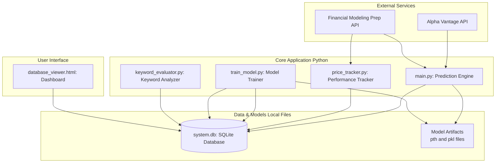
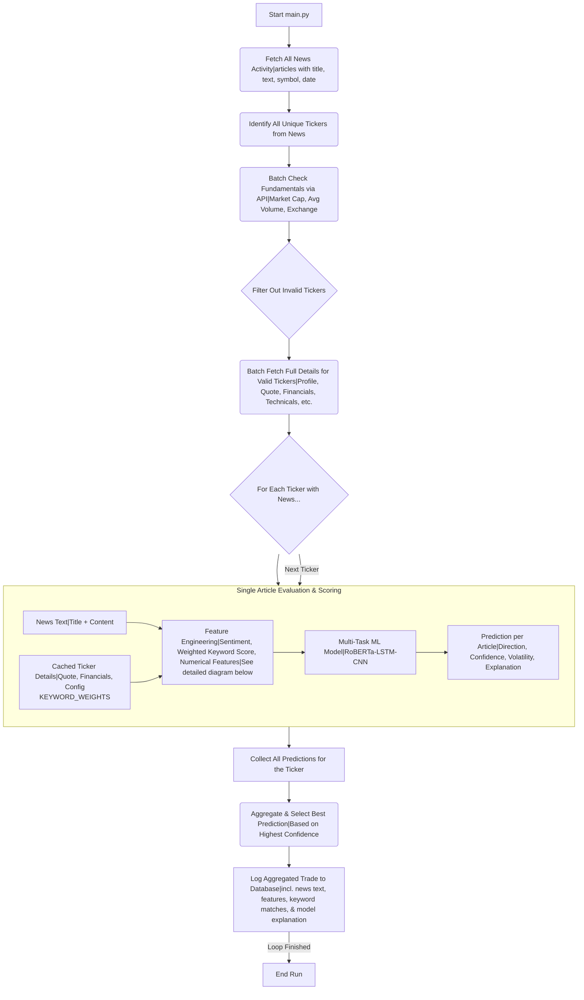
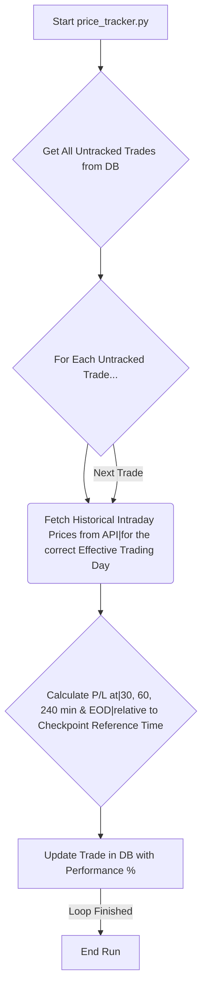
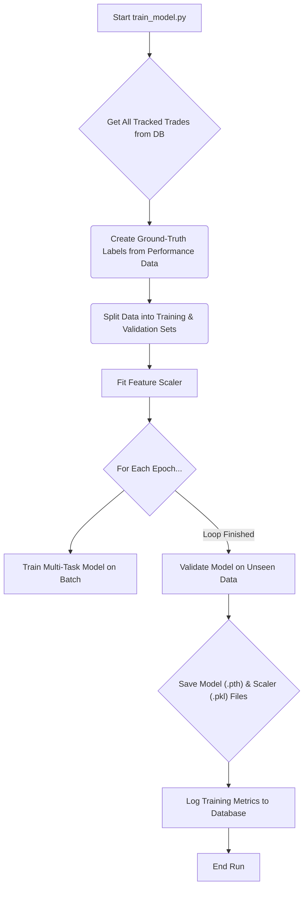
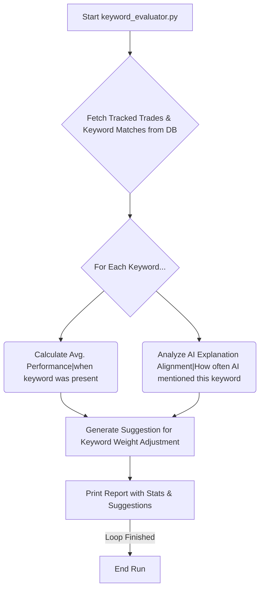
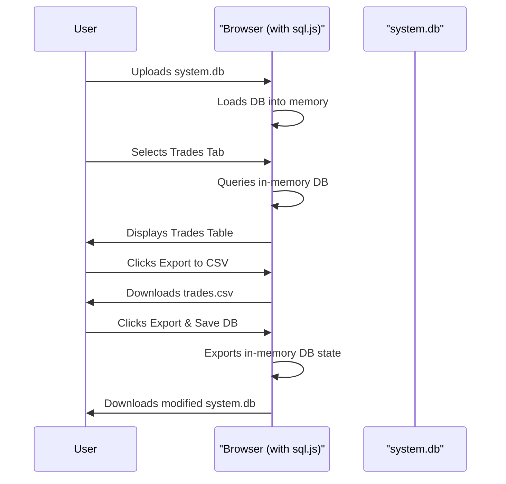

# Event-Driven Financial News Analysis & Trading System

This project is an event-driven application designed to analyze financial news, generate trade signals using a sophisticated multi-task machine learning model, and facilitate a continuous learning loop through performance tracking and automated retraining cycles.

## Table of Contents

- [Core Philosophy](#core-philosophy)
- [System Architecture](#system-architecture)
- [Detailed Workflows](#detailed-workflows)
  - [1. The Prediction Cycle (main.py)](#1-the-prediction-cycle-mainpy)
  - [2. The Performance Tracking Cycle (price_tracker.py)](#2-the-performance-tracking-cycle-price_trackerpy)
  - [2.1. Understanding Performance Calculation Logic](#21-understanding-performance-calculation-logic)
  - [3. Detailed Feature Engineering & Scoring for a Single News Item](#3-detailed-feature-engineering--scoring-for-a-single-news-item)
  - [4. The Retraining Cycle (train_model.py)](#4-the-retraining-cycle-train_modelpy)
  - [4.1. The Keyword Evaluation Cycle (keyword_evaluator.py)](#41-the-keyword-evaluation-cycle-keyword_evaluatorpy)
  - [5. The Database Viewer Interaction (database_viewer.html)](#5-the-database-viewer-interaction-database_viewerhtml)
- [Database Schema](#database-schema)
- [Key Features Highlighted](#key-features-highlighted)
- [Setup and How to Run](#setup-and-how-to-run)
  - [Installation](#installation)
  - [Configuration](#configuration)
  - [Execution Cycle](#execution-cycle)
  - [Utility Scripts](#utility-scripts)

## Core Philosophy

The system is built on two key principles:

- **Event-Driven Processing:** Instead of running on a simple schedule, the system processes news articles as individual events. This allows for a more granular and responsive analysis suitable for near-real-time environments.
- **Continuous Learning:** The application is not static. It is a full-cycle system that logs its predictions, tracks their real-world performance, and uses that performance data to retrain and improve its own underlying model over time.
- **Data-Driven Keyword Refinement:** The system includes tools to evaluate the effectiveness of predefined keywords and leverage model insights to suggest improvements, creating a feedback loop for keyword strategy.
- **Model Interpretability:** Provides explanations for model predictions by highlighting influential words from the news text, offering insights into the model's decision-making process.

## System Architecture

The application consists of several key components that interact through a central SQLite database, creating a robust cycle of prediction, tracking, and learning.



## Detailed Workflows

### 1. The Prediction Cycle (main.py)

This is the main engine of the system. It fetches financial news (typically articles with a title, textual content, publication date, and associated stock symbol), identifies relevant items, enriches them with market and fundamental data, and then uses a machine learning model to generate trade signals. Its workflow is optimized for batching API calls for efficiency.



### 2. The Performance Tracking Cycle (price_tracker.py)

This script runs after market hours to backfill the performance of trades made by main.py.



### 2.1. Understanding Performance Calculation Logic

The price_tracker.py script evaluates trade performance based on the entry_price logged by main.py and the intraday price movements on an "Effective Trading Day." The key aspects are:

- **entry_price**: This is the price fetched by main.py when the trade signal was generated.

  - If main.py runs during market hours, entry_price is the current market price.
  - If main.py runs after market hours or on a non-trading day, entry_price will be the closing price of the last trading session.

- **Effective Trading Day for Evaluation**: price_tracker.py determines this day:

  - If the trade was logged during market hours of a trading day, that same day is used.
  - If the trade was logged after market hours or on a non-trading day (weekend/holiday), the next actual trading day is used.

- **Checkpoint Reference Time**: This is the starting point from which the 30-min, 60-min, etc., checkpoints are measured.

  - If the trade_log_datetime (when main.py logged the trade) falls within the market hours of the Effective Trading Day, the trade_log_datetime itself is used as the reference.
  - Otherwise (e.g., trade logged after hours and evaluation is on the next market open), the market open of the Effective Trading Day is used as the reference.

- **Performance Calculation**: The logged entry_price is compared against prices at checkpoints relative to this "Checkpoint Reference Time" on the "Effective Trading Day."

The table below illustrates various scenarios:

| Scenario Description                                        | Trade Logged Time (main.py)           | entry_price Logged (Approx.)           | price_tracker.py Run Time              | Effective Trading Day for Evaluation (by price_tracker.py) | Checkpoint Reference Time (within Effective Day) | perf_30_min_pct Calculation Basis                                                                                                       | perf_eod_pct Calculation Basis                                                                                                   |
| ----------------------------------------------------------- | ------------------------------------- | -------------------------------------- | -------------------------------------- | ---------------------------------------------------------- | ------------------------------------------------ | --------------------------------------------------------------------------------------------------------------------------------------- | -------------------------------------------------------------------------------------------------------------------------------- |
| 1. Standard: Trade Logged & Tracked Same Day (Market Hours) | Friday, 11:00 AM                      | Price @ Fri 11:00 AM                   | Friday, 5:00 PM (after market close)   | Friday                                                     | Friday, 11:00 AM                                 | ((Price@Fri_11:30AM - EntryPrice@Fri_11:00AM) / EntryPrice@Fri_11:00AM) \* 100                                                          | ((EOD_Price@Fri_Close - EntryPrice@Fri_11:00AM) / EntryPrice@Fri_11:00AM) \* 100                                                 |
| 2. Trade Logged After Hours, Track Next (Non-Trading) Day   | Friday, 7:00 PM                       | Friday's Closing Price                 | Saturday, 10:00 AM                     | Monday                                                     | Monday, 9:30 AM (Market Open)                    | ((Price@Mon_10:00AM - EntryPrice@Fri_Close) / EntryPrice@Fri_Close) \* 100                                                              | ((EOD_Price@Mon_Close - EntryPrice@Fri_Close) / EntryPrice@Fri_Close) \* 100                                                     |
| 3. Trade Logged on Weekend, Track on Weekend                | Saturday, 2:00 PM                     | Friday's Closing Price                 | Sunday, 10:00 AM                       | Monday                                                     | Monday, 9:30 AM (Market Open)                    | ((Price@Mon_10:00AM - EntryPrice@Fri_Close) / EntryPrice@Fri_Close) \* 100                                                              | ((EOD_Price@Mon_Close - EntryPrice@Fri_Close) / EntryPrice@Fri_Close) \* 100                                                     |
| 4. Trade Logged Before Market Open, Track Same Day          | Monday, 6:00 AM                       | Friday's Closing Price                 | Monday, 5:00 PM (after market close)   | Monday                                                     | Monday, 9:30 AM (Market Open)                    | ((Price@Mon_10:00AM - EntryPrice@Fri_Close) / EntryPrice@Fri_Close) \* 100                                                              | ((EOD_Price@Mon_Close - EntryPrice@Fri_Close) / EntryPrice@Fri_Close) \* 100                                                     |
| 5. Trade Logged After Hours, Track Next Trading Day         | Wednesday, 8:00 PM                    | Wednesday's Closing Price              | Thursday, 5:00 PM (after market close) | Thursday                                                   | Thursday, 9:30 AM (Market Open)                  | ((Price@Thu_10:00AM - EntryPrice@Wed_Close) / EntryPrice@Wed_Close) \* 100                                                              | ((EOD_Price@Thu_Close - EntryPrice@Wed_Close) / EntryPrice@Wed_Close) \* 100                                                     |
| 6. Trade Logged on Market Holiday, Track Next Trading Day   | Mon (Holiday), 10 AM                  | Friday's Closing Price                 | Tuesday, 5:00 PM (after market close)  | Tuesday                                                    | Tuesday, 9:30 AM (Market Open)                   | ((Price@Tue_10:00AM - EntryPrice@Fri_Close) / EntryPrice@Fri_Close) \* 100                                                              | ((EOD_Price@Tue_Close - EntryPrice@Fri_Close) / EntryPrice@Fri_Close) \* 100                                                     |
| 7. Multiple Trades (Fri Mid-Day, Sat), Track Mon PM         | Trade A: Fri 2PM<br>Trade B: Sat 10AM | A: Price@Fri_2PM<br>B: Price@Fri_Close | Monday, 5:00 PM                        | A: Friday<br>B: Monday                                     | A: Fri 2:00 PM<br>B: Mon 9:30 AM (Market Open)   | A: ((Price@Fri_2:30PM - EntryA@Fri_2PM) / EntryA@Fri_2PM) _ 100<br>B: ((Price@Mon_10:00AM - EntryB@Fri_Close) / EntryB@Fri_Close) _ 100 | A: ((EOD@Fri_Close - EntryA@Fri_2PM) / EntryA@Fri_2PM) _ 100<br>B: ((EOD@Mon_Close - EntryB@Fri_Close) / EntryB@Fri_Close) _ 100 |

### 3. Detailed Feature Engineering & Scoring for a Single News Item

This diagram elaborates on the "Feature Engineering" and "Multi-Task ML Model" steps within the "Single Article Evaluation & Scoring" subgraph of the Prediction Cycle. It shows how raw news and ticker data are transformed into features that the model uses to make its predictions.

```mermaid
graph LR
    subgraph Inputs
        direction TB
        NewsItem["News Item|Title, Text, Symbol, Date"]
        TickerData["Cached Ticker Details|Profile, Quote, Financials, Technicals, DCF, Filings, etc."]
        Config["config.py|KEYWORD_WEIGHTS"]
    end

    subgraph FeatureExtraction ["Numerical & Text Feature Preparation"]
        direction TB
        NewsItem --> SentAnalysis["Sentiment Analysis (FinBERT & FinBERT-Tone)"]
        NewsItem --> KeywordAnalysis["Keyword Analysis & Scoring|via feature_engineering.py"]
        Config --> KeywordAnalysis

        TickerData --> NumFeatPrep["Other Numerical Feature Prep|DCF/Price, Growth, RSI, SMA, etc.|via prepare_numerical_features()"]
        NewsItem --> NumFeatPrep
        NumFeatPrep --> OtherNumFeatures["Other Numerical Features"]

        SentAnalysis --> AllNumFeatures[Concatenate Sentiment & Keyword Score]
        KeywordAnalysis --> AllNumFeatures
        AllNumFeatures --> Scaler["StandardScaler (Fitted during training)"]
        Scaler --> ScaledNumFeatures["Scaled Numerical Features (Vector)"]

        NewsItem --> RobertaInput["RoBERTa Tokenizer"]
        RobertaInput --> EncodedText["Tokenized Text|Input IDs, Attention Mask"]
    end

    subgraph ModelPredictionAndExplanation ["Model Prediction & Explanation"]
        direction TB
        EncodedText --> ML_Model["Multi-Task ML Model|RoBERTa-LSTM-CNN"]
        ScaledNumFeatures --> ML_Model
        ML_Model --> ModelRawOutputs["Direction Logits, Confidence, Volatility, Raw Attentions"]

        ModelRawOutputs --> PredDir["Predicted Direction|BUY/SELL/NONE"]
        ModelRawOutputs --> PredConf["Predicted Confidence|0.0 to 1.0"]
        ModelRawOutputs --> PredVol["Predicted Volatility|0.0 to 1.0"]

        ModelRawOutputs --> AttentionsData["Raw Attention Scores"]
        EncodedText --> ExplanationGen["Explanation Generation|get_explanation_from_attentions in ml_models.py"]
        AttentionsData --> ExplanationGen
        ExplanationGen --> ExplanationOutput["Model Explanation|List of influential words"]
        ExplanationOutput --> LogToDB_Explanation["Logged to trades.feature_model_explanation"]
    end

    Inputs --> FeatureExtraction
    FeatureExtraction --> ModelPredictionAndExplanation
```



### 4. The Retraining Cycle (train_model.py)

This script uses the performance data to train a new, smarter version of the model.



### 4.1. The Keyword Evaluation Cycle (keyword_evaluator.py)

This script analyzes the effectiveness of predefined keywords and provides suggestions for refining their weights.



### 4.2. The Continuous Learning Cycle (learning.py)

While `train_model.py` performs the mechanics of training, `learning.py` contains the `ContinuousLearningSystem` which provides the intelligence to decide *when* to trigger a retraining. This closes the feedback loop and automates the model improvement process.

```mermaid
flowchart TD
    A[Start learning.py] --> B{Get Untracked Trades (status='pending')}
    B -- "Trades > 0" --> C["Log: 'price_tracker.py must run first'"]
    B -- "Trades = 0" --> D{Get All Completed Trades for Training}
    D --> E{Get Last Training Info from DB}
    E --> F("Calculate New Completed Trades since Last Run")
    F --> G{New Trades >= Retraining Threshold?}
    G -- "Yes" --> H[Trigger train_model.py]
    G -- "No" --> I["Log: 'Not enough new data'"]
    H --> J[End Run]
    C --> J
    I --> J
```

### 5. The Database Viewer Interaction (database_viewer.html)

This HTML file provides a client-side interface to interact with the system.db file directly in the browser using sql.js.



The viewer also allows exporting table data to CSV and viewing detailed keyword matches and model explanations for each trade.

## Database Schema

The system uses a central SQLite database (`system.db`) with several tables to manage state and log data.

### `trades` Table

This is the primary table, storing predictions, features, and subsequent performance.

| Column Name | Populated By | Description | Role in Learning & Model Influence |
|---|---|---|---|
| `id` | SQLite (DB) | Automatically generated unique integer (Primary Key). | Identifier; Not used in model training. |
| `timestamp` | `main.py` | ISO datetime string of when the prediction was logged. | Contextual; Used for time-series analysis and performance tracking logic. |
| `ticker` | `main.py` | The stock ticker symbol. | Identifier; Not a direct model feature. |
| `decision` | `main.py` | The trade direction ('LONG', 'SHORT', 'NONE') predicted by the model. | Output of the model, used for evaluation. |
| `entry_price` | `main.py` | Stock price at the time of prediction. | Contextual; Used to calculate `perf_*` columns which become training targets. |
| `predicted_confidence` | `main.py` | Model's confidence (0-1) in its decision. | Output of the model; becomes a target variable during training. |
| `predicted_volatility` | `main.py` | Model's prediction (0-1) of price volatility. | Output of the model; becomes a target variable during training. |
| `news_text` | `main.py` | The full news article text. | **Primary Textual Input** for the RoBERTa model. |
| `perf_..._pct` | `price_tracker.py` | % change between `entry_price` and price at various checkpoints. | **Used to derive Ground-Truth Labels** for training (direction, confidence, volatility). |
| `perf_..._timestamp` | `price_tracker.py` | The exact timestamp of the price used for the performance calculation. | Informational; provides context for the performance metric. |
| `feature_...` | `main.py` | Numerical features like sentiment scores, keyword scores, RSI, etc. | **Numerical Input Features** for the model. |
| `feature_model_explanation` | `main.py` | JSON string list of influential words identified by the model's attention mechanism. | Informational; for model interpretability and analysis in `keyword_evaluator.py`. |
| `tracking_status` | `price_tracker.py` | Status of performance tracking ('pending', 'completed', 'failed'). | System state management. |

### `training_history` Table

Logs the results of each model training run.

| Column Name | Populated By | Description |
|---|---|---|
| `id` | SQLite (DB) | Unique ID for the training run. |
| `training_timestamp` | `train_model.py` | When the training run was completed. |
| `model_version` | `train_model.py` | The filename of the saved model artifact (`.pth` file). |
| `avg_training_loss` | `train_model.py` | The average loss calculated on the training dataset. |
| `val_accuracy` | `train_model.py` | The accuracy of the model on the validation dataset. |
| `val_f1_macro` | `train_model.py` | The macro F1-score on the validation dataset. |
| `val_confidence_mse` | `train_model.py` | The Mean Squared Error for the confidence prediction task on the validation set. |
| `val_volatility_mse` | `train_model.py` | The Mean Squared Error for the volatility prediction task on the validation set. |
| `notes` | `train_model.py` | Additional notes, such as the number of samples used for training. |

### `keyword_matches` Table

Logs every instance of a keyword from `config.py` being found in a news article, linking it to a specific trade.

| Column Name | Populated By | Description |
|---|---|---|
| `id` | SQLite (DB) | Unique ID for the match. |
| `trade_id` | `main.py` | Foreign key linking to the `trades` table. |
| `keyword` | `main.py` | The keyword that was matched. |
| `weight` | `main.py` | The weight of the keyword at the time of the match, from `config.py`. |

### Other Tables

- **`processed_news`**: Logs the URLs of news articles that have already been processed to prevent duplicate analysis.
- **`failed_tickers`**: Logs tickers that consistently fail during data fetching to avoid repeated errors.

## Key Features Highlighted

### Advanced Multi-Task Model

The core is a RoBERTa-based neural network that simultaneously predicts three outputs:

- **Trade Direction** (BUY/SELL/NONE)
- **Prediction Confidence** (Magnitude of the expected move)
- **Price Volatility** (Expected range/risk associated with the trade)

### Rich Feature Engineering

Leverages a wide array of features for its predictions, including:

- **Dual-Sentiment Analysis**: Uses both a general FinBERT model and a specialized FinBERT-Tone model for nuanced sentiment scores.
- **Weighted Keyword Scoring**: Calculates a `keyword_score` based on predefined weights for specific keywords, allowing for more nuanced textual analysis. Individual keyword matches are logged for detailed review.
- **Model Interpretability**: Generates explanations for predictions by highlighting influential words from the news text using RoBERTa's attention scores.

### Time-Based Performance Evaluation

The system is built to test a time-based exit strategy by calculating the hypothetical performance of each trade at 30, 60, 240 minutes, and end-of-day, considering realistic trade execution windows.

### Interactive Dashboard & Data Manager

The database_viewer.html provides a rich user interface to:

- View high-level performance analytics (Win/Loss Ratio, Top Performers, etc.).
- Get operational guidance on when to run tracking or training scripts.
- Inspect, sort, filter, and manage data in all database tables.
- Select and delete multiple rows at once.
- View the full news text, matched keywords (from `config.py`), and the model's attention-based explanation for each trade in a detailed modal view.
- Export table data to CSV for external analysis.

## Setup and How to Run

### Installation

1.  **Clone the repository** and navigate into the `event_driven` directory.
2.  **Create and activate a Python virtual environment**:
    ```bash
    python3 -m venv venv
    source venv/bin/activate
    ```
3.  **Install dependencies** from the `requirements.txt` file:
   ```bash
   pip install -r requirements.txt
   ```

### Configuration

1.  **API Keys**: Create a file named `.env` in the `event_driven` directory. Add your Financial Modeling Prep API key:
    ```env
    FMP_API_KEY="your_api_key_here"
    ```
2.  **System Settings**: Review and adjust settings in `config.py`. Key settings include:
    - `MIN_MARKET_CAP_USD`: Minimum market capitalization for a stock to be considered.
    - `KEYWORD_WEIGHTS`: The weights assigned to different keywords for scoring.
    - `NEWS_FETCH_LIMIT`: The number of news articles to fetch in one run.
    - `PERFORMANCE_CHECKPOINTS`: The time intervals (in minutes) for performance tracking.
    - `RETRAINING_THRESHOLD`: The number of new completed trades required to trigger a model retrain via `learning.py`.

### Execution Cycle

1.  **Generate Predictions**: Run `main.py` to fetch the latest news and log new trade predictions to the database. This uses the best available trained model.

   ```bash
   # Run continuously (default behavior)
   python main.py

   # Run only one cycle and then exit
   python main.py --run-once
   ```

2. **Track Performance**: After the market closes (or at a suitable interval), run `price_tracker.py` to calculate the actual performance of the trades made earlier.

   ```bash
   python price_tracker.py
   ```

3. **Train a New Model**: Once you have accumulated a good amount of tracked trade data, run `train_model.py` to create a new, smarter version of the model.

   ```bash
   python train_model.py
   ```

4. **Evaluate Keywords (Optional but Recommended)**: Run `keyword_evaluator.py` to analyze the performance of your `KEYWORD_WEIGHTS` and get suggestions for refinement.

   ```bash
   python keyword_evaluator.py
   ```

   Based on the output, you might update `config.py` and potentially retrain the model.

5. **Monitor**: Open `database_viewer.html` in your browser and upload the `system.db` file to see the state of the system, analyze results, and manage your data.

### Deployment Considerations

To run this system automatically, you'll need to schedule the execution of the core scripts. A simple and effective method is using `cron` on a Linux-based server.

**Example `crontab` setup:**

```bash
# Edit your crontab file
crontab -e

# Add entries like these, adjusting paths and schedules as needed.
# Assumes your project is in /home/user/news_analyzer/event_driven

# Run the prediction engine every 15 minutes on weekdays during market hours
*/15 9-16 * * 1-5 /home/user/news_analyzer/event_driven/venv/bin/python /home/user/news_analyzer/event_driven/main.py >> /home/user/news_analyzer/event_driven/logs/main.log 2>&1

# Run the price tracker once every evening after the market closes
30 17 * * 1-5 /home/user/news_analyzer/event_driven/venv/bin/python /home/user/news_analyzer/event_driven/price_tracker.py >> /home/user/news_analyzer/event_driven/logs/price_tracker.log 2>&1

# Run the continuous learning check once a day
0 18 * * * /home/user/news_analyzer/event_driven/venv/bin/python /home/user/news_analyzer/event_driven/learning.py >> /home/user/news_analyzer/event_driven/logs/learning.log 2>&1

# Run the keyword evaluator once a week on Sunday
0 20 * * 0 /home/user/news_analyzer/event_driven/venv/bin/python /home/user/news_analyzer/event_driven/keyword_evaluator.py >> /home/user/news_analyzer/event_driven/logs/keyword_evaluator.log 2>&1
```

For more complex dependency management between tasks (e.g., ensuring `price_tracker.py` only runs after `main.py` has finished for the day), consider using a workflow orchestrator like Apache Airflow or Prefect.

### Troubleshooting

-   **Problem: `price_tracker.py` fails for many tickers.**
    -   **Check API Key & Limits**: Ensure your `FMP_API_KEY` is correct and that you haven't exceeded your plan's rate limits.
    -   **Check Network**: Verify the server has a stable internet connection.
    -   **Inspect `failed_tickers` Table**: Use the `database_viewer.html` to see which tickers are failing and why. It might be due to delistings or invalid symbols.

-   **Problem: Model performance isn't improving after retraining.**
    -   **Data Volume**: Check the `notes` in the `training_history` table. Are you training on enough new samples? You may need to lower the `RETRAINING_THRESHOLD` in `config.py` or gather more data.
    -   **Keyword Effectiveness**: Run `keyword_evaluator.py`. Poorly performing keywords can introduce noise. Adjust weights in `config.py` based on its suggestions.
    -   **Label Quality**: The ground-truth labels are derived from performance data. If the market is consistently erratic, the labels might be noisy. Consider adjusting the `create_multi_task_labels` logic in `train_model.py`.

-   **Problem: How do I debug a single bad trade?**
    -   Use the `database_viewer.html` to find the trade by its `id`.
    -   Click the row to open the detailed modal view.
    -   **Inspect the Inputs**: Review the `news_text`, the `feature_*` columns, and the `feature_model_explanation`. Does the explanation make sense? Were the sentiment or keyword scores skewed?
    -   **Compare to Output**: Compare the model's `decision` and `predicted_confidence` with the actual outcome in the `perf_*` columns. This can reveal patterns where the model is consistently wrong (e.g., underperforming on a specific type of news).

### Utility Scripts

- **Resetting Trade Tracking**: If you need to re-run the performance tracking for all trades from scratch (e.g., after a logic change in `price_tracker.py`), you can use the `reset_trade_tracking.py` script. It will reset the `tracking_status` to `pending` and clear all `perf_*` columns for every trade in the database.

  ```bash
  python reset_trade_tracking.py
  ```

  The script will ask for confirmation before modifying the database.

- **Migrating Timestamps to UTC**: For developers working with older versions of the database that may contain naive (non-timezone-aware) timestamps, the `migrate_timestamps_to_utc.py` script provides a one-time utility to convert them. It assumes the original timestamps were recorded in `US/Eastern` and converts them to timezone-aware UTC strings.

  ```bash
  python migrate_timestamps_to_utc.py
  ```

  This script should only need to be run once on legacy data.
