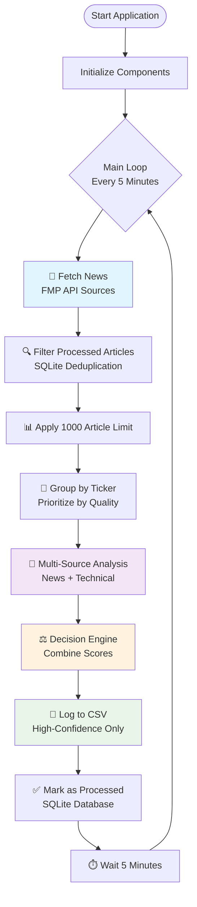
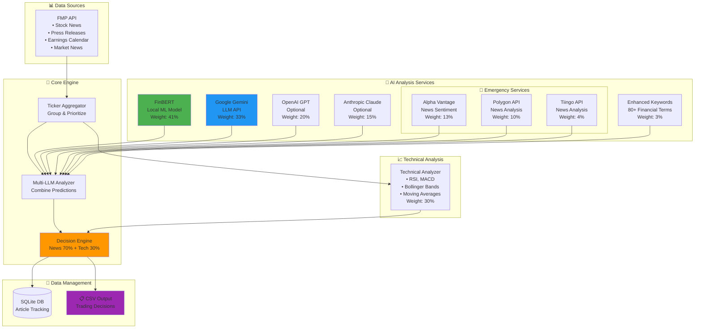
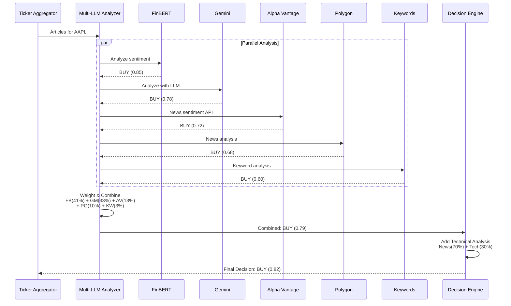
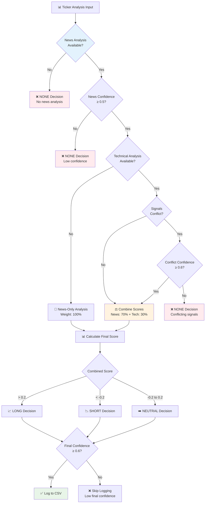
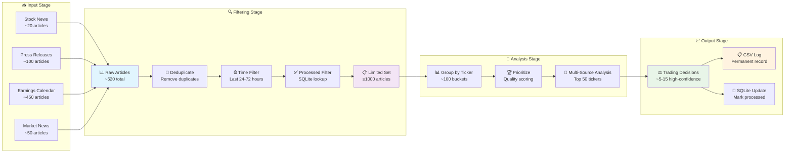
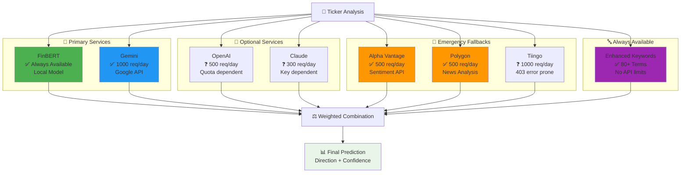
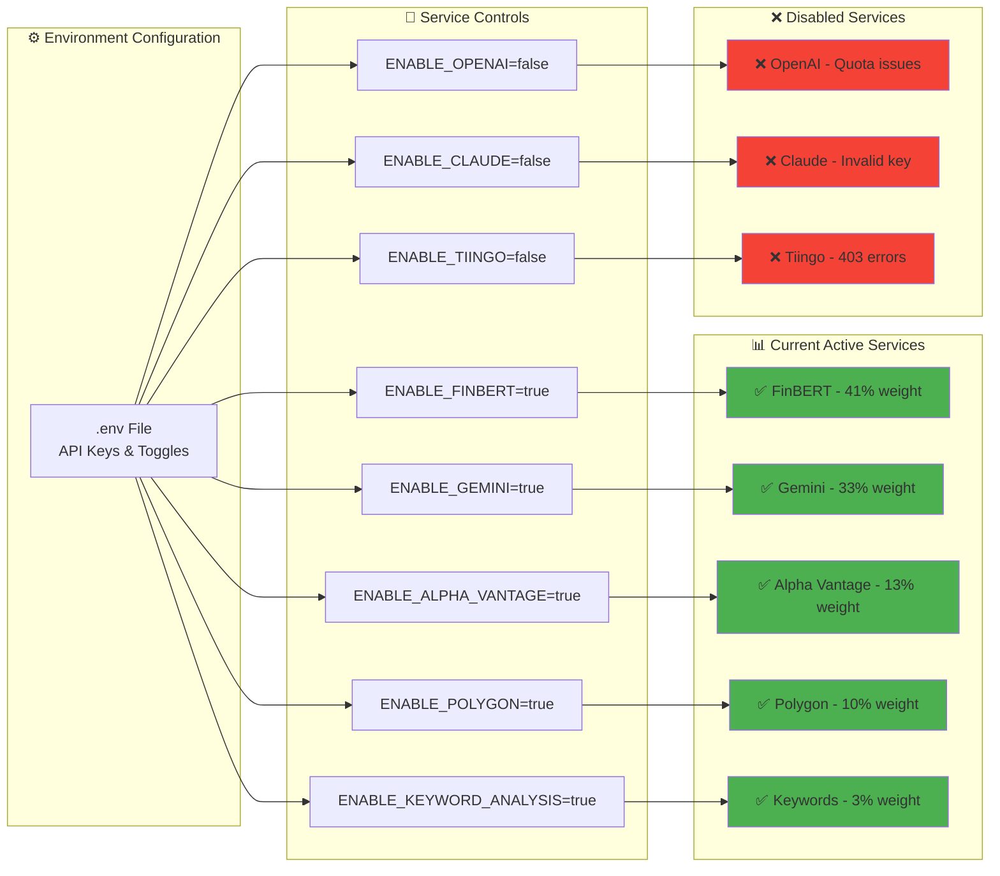
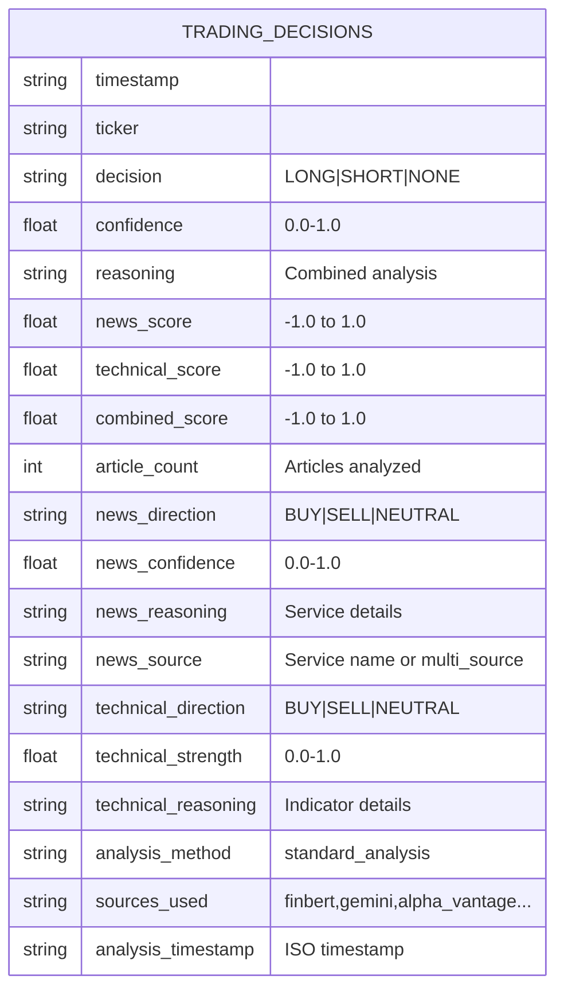

# Financial News Analysis System - Architecture Diagrams

## 1. System Overview & Main Flow

## 2. Component Architecture

## 3. Multi-Source Analysis Flow

## 4. Decision Engine Workflow

## 5. Data Processing Pipeline

## 6. Service Integration & Fallback Chain

## 7. Configuration & Service Toggles

## 8. CSV Output Schema

---

## Usage Instructions

1. **Copy any diagram** you want to your README.md
2. **Mermaid renders automatically** on GitHub, GitLab, and most modern markdown viewers
3. **Customize as needed** - modify colors, add/remove components
4. **Live preview** available at [Mermaid Live Editor](https://mermaid.live/)

## Diagram Highlights

- **📊 System Overview**: Perfect for explaining the main flow to users
- **🧠 Component Architecture**: Shows how all pieces fit together  
- **⚖️ Decision Engine**: Explains the scoring and threshold logic
- **🔄 Multi-Source Analysis**: Demonstrates the AI service integration
- **📈 Data Pipeline**: Shows data transformation stages
- **⚙️ Configuration**: Explains service toggles and weights

These diagrams will make your README much more professional and help users understand the sophisticated multi-layered analysis system you've built!