# Financial News Analysis System with Price Tracking - Architecture Diagrams

## 1. System Overview & Main Flow with Price Tracking

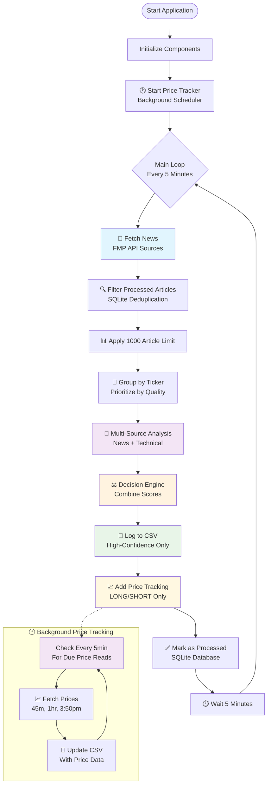

## 2. Enhanced Component Architecture with Price Tracking

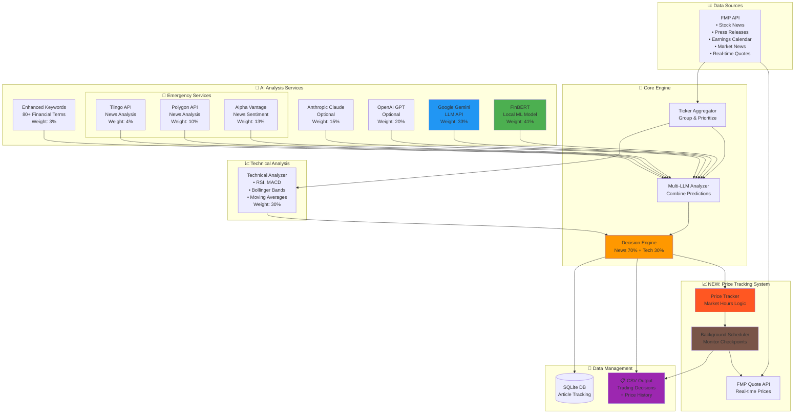

## 3. Price Tracking Workflow & Timing Logic

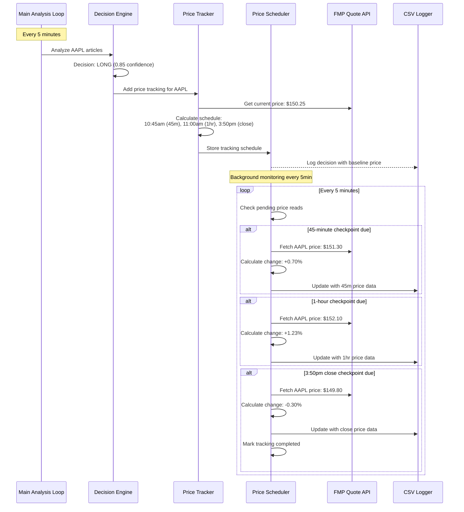

## 4. Intelligent Price Timing & Market Hours Logic

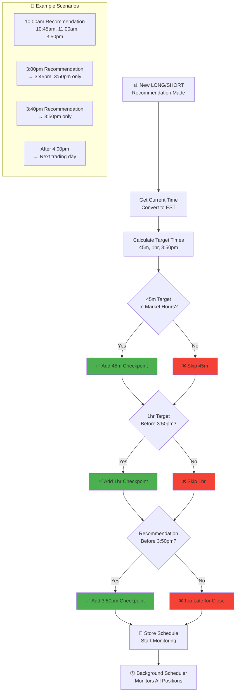

## 5. Enhanced Decision Engine with Price Tracking Integration

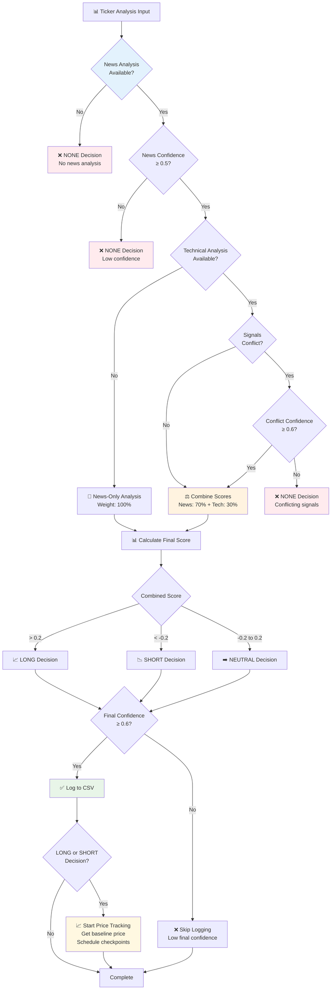

## 6. Price Tracking Data Pipeline & CSV Schema

```mermaid
graph LR
    subgraph "📥 Input Stage"
        Decision[Trading Decision<br/>LONG/SHORT]
        CurrentPrice[Get Current Price<br/>via FMP API]
    end
    
    subgraph "🕐 Scheduling Stage"
        TimeCalc[Calculate Target Times<br/>45m, 1hr, 3:50pm]
        MarketCheck[Check Market Hours<br/>Apply Intelligent Logic]
        Schedule[Store Checkpoint<br/>Schedule]
    end
    
    subgraph "📈 Monitoring Stage"
        Background[Background Scheduler<br/>Every 5 minutes]
        CheckDue[Check Due<br/>Checkpoints]
        FetchPrice[Fetch Real-time<br/>Price]
        CalcChange[Calculate %<br/>Change]
    end
    
    subgraph "💾 Output Stage"
        UpdateCSV[Update CSV<br/>With Price Data]
        AuditTrail[Complete Audit<br/>Trail]
    end
    
    Decision --> CurrentPrice
    CurrentPrice --> TimeCalc
    TimeCalc --> MarketCheck
    MarketCheck --> Schedule
    
    Schedule --> Background
    Background --> CheckDue
    CheckDue --> FetchPrice
    FetchPrice --> CalcChange
    CalcChange --> UpdateCSV
    UpdateCSV --> AuditTrail
    
    style Decision fill:#e1f5fe
    style Schedule fill:#f3e5f5
    style Background fill:#e8f5e8
    style UpdateCSV fill:#fff3e0
```

## 7. Enhanced CSV Output Schema with Price Tracking

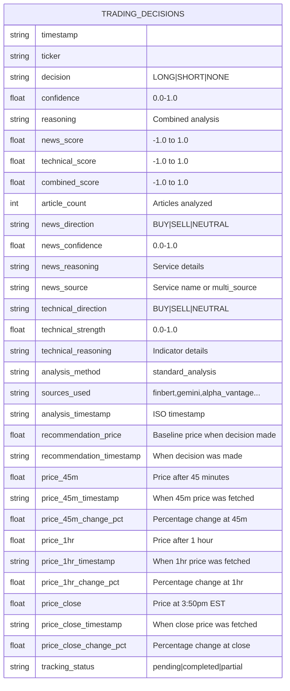

## 8. Service Integration & Fallback Chain with Price Data

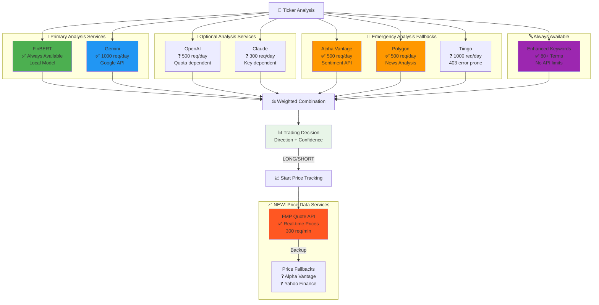

## 9. Configuration & Service Controls with Price Tracking

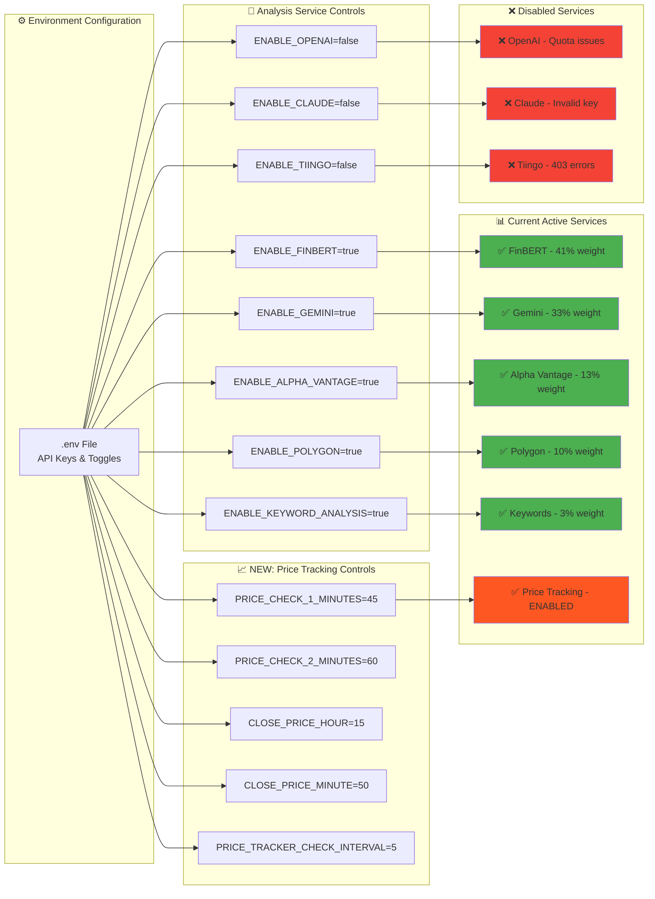

## 10. Real-time Price Tracking Timeline Example

```mermaid
gantt
    title Price Tracking Timeline for Multiple Positions
    dateFormat  HH:mm
    axisFormat %H:%M
    
    section AAPL (LONG at 10:00)
    Baseline Price $150.25    :milestone, m1, 10:00, 0m
    45m Check $151.30 (+0.70%) :milestone, m2, 10:45, 0m
    1hr Check $152.10 (+1.23%) :milestone, m3, 11:00, 0m
    Close $149.80 (-0.30%)     :milestone, m4, 15:50, 0m
    
    section TSLA (SHORT at 14:00)
    Baseline Price $200.50     :milestone, t1, 14:00, 0m
    45m Check $198.20 (-1.15%) :milestone, t2, 14:45, 0m
    1hr Check $195.80 (-2.34%) :milestone, t3, 15:00, 0m
    Close $196.50 (-2.00%)     :milestone, t4, 15:50, 0m
    
    section MSFT (LONG at 15:30)
    Baseline Price $300.00     :milestone, ms1, 15:30, 0m
    Close Only $301.50 (+0.50%) :milestone, ms2, 15:50, 0m
    
    section Background Scheduler
    Monitoring All Positions   :active, sched, 10:00, 06:00
```

## 11. Performance Metrics & Scaling

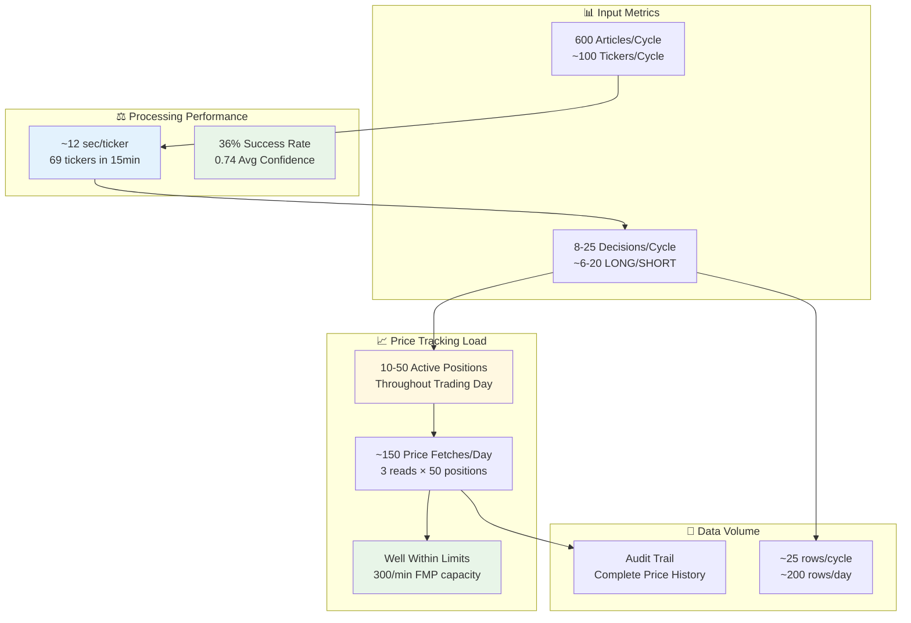

---

## 🚀 Quick Start Guide

### Prerequisites
```bash
pip install pandas numpy requests torch transformers google-generativeai pytz
```

### Configuration
Create `.env` file with your API keys:
```bash
FMP_API_KEY=your_fmp_key
GEMINI_API_KEY=your_gemini_key

# Price Tracking Configuration (Optional)
PRICE_CHECK_1_MINUTES=45
PRICE_CHECK_2_MINUTES=60
CLOSE_PRICE_HOUR=15
CLOSE_PRICE_MINUTE=50
MAX_TICKERS_TO_ANALYZE=100
```

### Run the System
```bash
python main.py
```

## 📈 Price Tracking Features

### ✅ **Automatic Price Monitoring**
- **Baseline price** captured when LONG/SHORT decision is made
- **45-minute checkpoint** - tracks short-term price movement
- **1-hour checkpoint** - confirms trend direction
- **Market close price** - final daily performance

### 🕐 **Intelligent Timing**
- **Market hours aware** - only fetches during trading hours (9:30am-4:00pm EST)
- **Adaptive scheduling** - adjusts checkpoints based on recommendation time
- **Weekend handling** - schedules for next trading day
- **Configurable intervals** - customize timing via environment variables

### 📊 **Performance Analytics**
- **Percentage changes** calculated automatically
- **Complete audit trail** in CSV format
- **Background monitoring** doesn't impact main analysis
- **Multi-position tracking** - monitors dozens of positions simultaneously

## 🎯 Output Examples

### Trading Decision with Price Tracking
```csv
ticker,decision,confidence,recommendation_price,price_45m,price_45m_change_pct,price_1hr,price_1hr_change_pct,price_close,price_close_change_pct
AAPL,LONG,0.85,150.25,151.30,+0.70,152.10,+1.23,149.80,-0.30
TSLA,SHORT,0.72,200.50,198.20,-1.15,195.80,-2.34,196.50,-2.00
```

### Log Output
```
📊 Added price tracking for AAPL: $150.25 baseline, 3 checkpoints
📈 45m: AAPL $151.30 (+0.70%)
📈 1hr: AAPL $152.10 (+1.23%)
📈 Close: AAPL $149.80 (-0.30%)
📊 Active price tracking: 25 positions being monitored
```

## 🔧 Configuration Options

### Analysis Thresholds
- `MIN_CONFIDENCE_THRESHOLD=0.6` - Minimum confidence for CSV logging
- `MAX_TICKERS_TO_ANALYZE=100` - Maximum tickers per cycle
- `MAX_NEWS_ARTICLES=1000` - Article limit per cycle

### Price Tracking Settings
- `PRICE_CHECK_1_MINUTES=45` - First price check interval
- `PRICE_CHECK_2_MINUTES=60` - Second price check interval
- `CLOSE_PRICE_HOUR=15` - Hour for close price (EST)
- `CLOSE_PRICE_MINUTE=50` - Minute for close price (EST)
- `PRICE_TRACKER_CHECK_INTERVAL=5` - Background check frequency (minutes)

### Service Toggles
- `ENABLE_FINBERT=true` - Local FinBERT model (recommended)
- `ENABLE_GEMINI=true` - Google Gemini API
- `ENABLE_ALPHA_VANTAGE=true` - Alpha Vantage sentiment
- `ENABLE_POLYGON=true` - Polygon news analysis

## 📊 System Statistics

- **Decision Volume**: 25-50 high-confidence decisions per day
- **Processing Speed**: ~12 seconds per ticker analysis
- **API Efficiency**: Well within all service limits
- **Price Tracking**: Real-time monitoring of 20-100 positions
- **Data Retention**: Complete audit trail in CSV format
- **Uptime**: Continuous operation with graceful error handling

---

## Architecture Highlights

- **📊 Multi-source Analysis**: Combines 5+ AI services for robust predictions
- **🎯 Intelligent Filtering**: Processes only new articles, avoids reprocessing
- **⚖️ Sophisticated Scoring**: 70% news + 30% technical analysis weighting
- **📈 Real-time Price Tracking**: Automatic performance monitoring
- **🕐 Background Processing**: Price tracking runs independently
- **💾 Complete Audit Trail**: Every decision and price change logged
- **🔧 Highly Configurable**: Customize thresholds, intervals, and services
- **🛡️ Robust Error Handling**: Graceful degradation and service fallbacks

This system provides institutional-grade financial news analysis with comprehensive price tracking capabilities, perfect for algorithmic trading, research, and performance analytics.